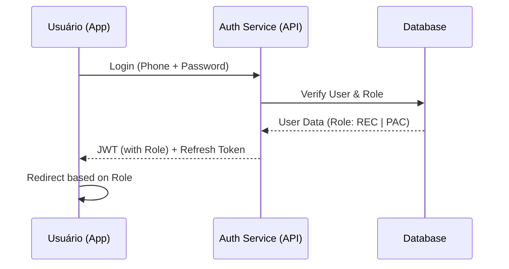
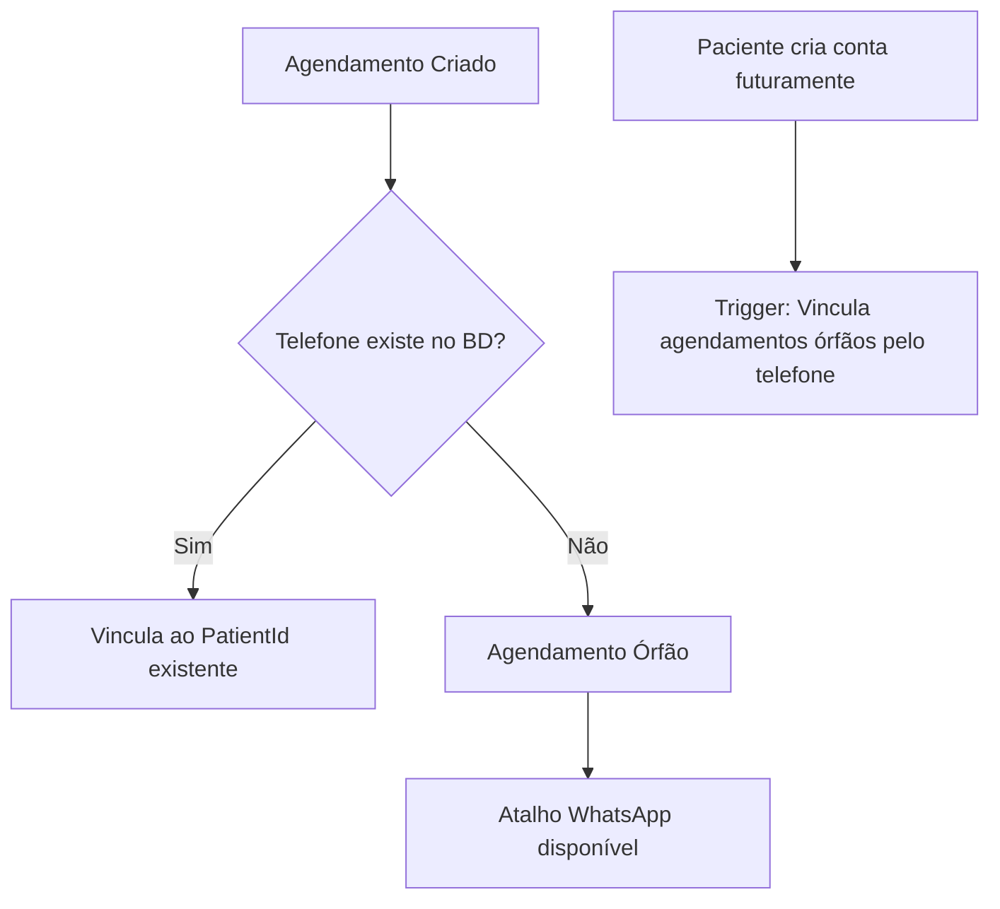

# ODONTOSYNC — Architecture Docs

## Fluxo de Autenticação e Role

```mermaid
sequenceDiagram
    participant User as Usuário (App)
    participant Auth as Auth Service (API)
    participant DB as Database

    User->>Auth: Login (Phone + Password)
    Auth->>DB: Verify User & Role
    DB-->>Auth: User Data (Role: REC | PAC)
    Auth-->>User: JWT (with Role) + Refresh Token
    User->>User: Redirect based on Role
```

## Lógica do Elo Central (Telefone)

```mermaid
graph TD
    A[Agendamento Criado] --> B{Telefone existe no BD?}
    B -- Sim --> C[Vincula ao PatientId existente]
    B -- Não --> D[Agendamento Órfão]
    D --> E[Atalho WhatsApp disponível]
    F[Paciente cria conta futuramente] --> G[Trigger: Vincula agendamentos órfãos pelo telefone]
```
