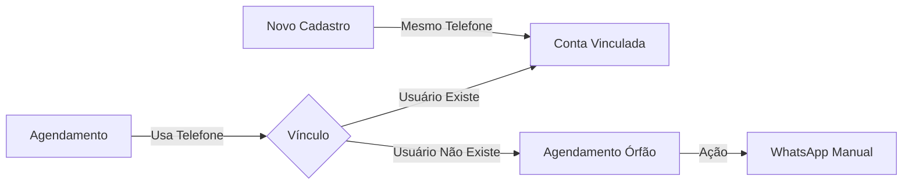
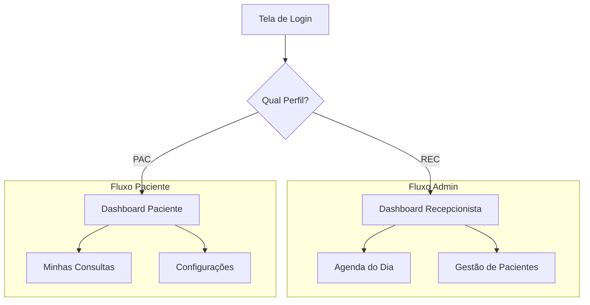
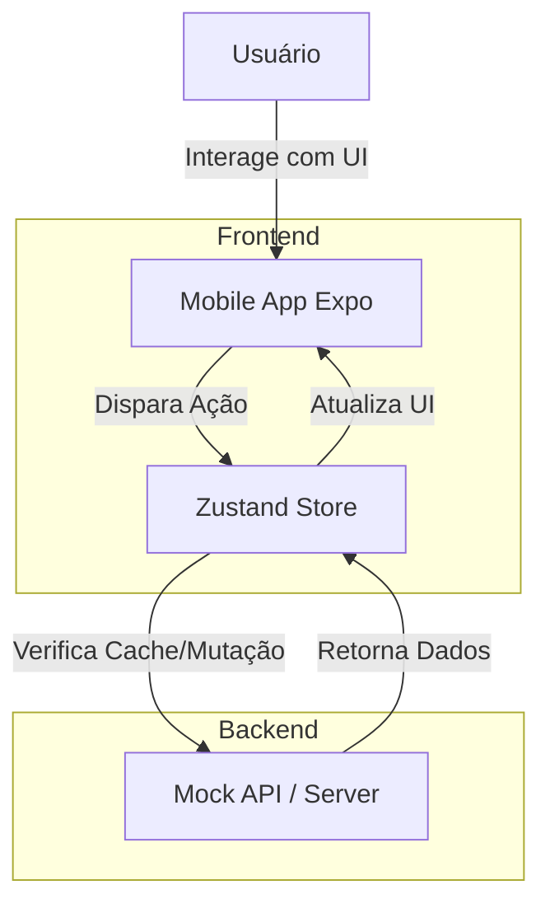
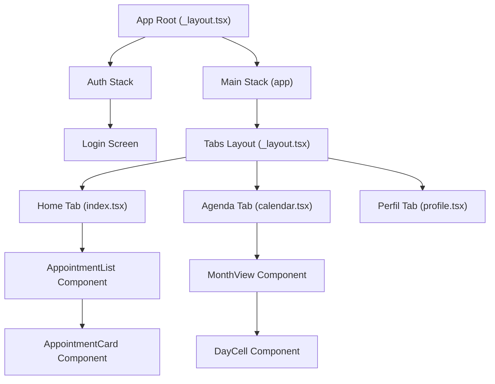

# 🏗️ Arquitetura OdontoSync

Este documento resume a estrutura técnica e as regras de negócio fundamentais do projeto.

---

## 1. O Conceito: "Elo Central" (Telefone)
O número de telefone é o identificador universal que conecta agendamentos a usuários, mesmo que o usuário ainda não tenha uma conta.



---

## 2. Estrutura de Navegação (RBAC)
O app se divide em dois mundos baseados no perfil do usuário após o login.

| Perfil | Destino Principal | Funcionalidade Chave |
| :--- | :--- | :--- |
| **Recepcionista** | `(admin)/calendar` | Gestão de horários e envio de notificações. |
| **Paciente** | `(app)/appointments` | Visualização de consultas e perfil pessoal. |



---

## 3. Data Flow



---

## 4. Component Tree



---

## 5. Pilares Técnicos
Adoção de **Frontend-First** com desacoplamento total do Backend.

- **Interface**: React Native + Expo + NativeWind (Tailwind).
- **Estado**: Zustand (Simples, rápido e persistente).
- **Dados**: Camada de `Mocks` que simula a API (Zod para validação).
- **Navegação**: Expo Router (Baseada em arquivos).

---

## 6. Organização de Pastas (True North)
Estrutura pensada para isolar lógica de negócio de componentes visuais.

```text
src/
├── features/    # Lógica de Negócio (ex: auth, appointments, profile)
├── components/  # UI Reutilizável (ex: Button, Card, Input)
├── services/    # Chamadas de API e Persistência (Zustand)
├── mocks/       # Dados estáticos para desenvolvimento
└── app/         # Rotas e Páginas (Expo Router)
```

---

## 7. Fluxo de Notificações
- **Automático**: Se o paciente tem o App, recebe Push.
- **Semi-Automático**: Se não tem o App, a recepcionista clica no ícone do WhatsApp para disparar a mensagem pré-configurada.

> [!IMPORTANT]
> **Regra de Ouro**: Nunca deletar registros. Usar `status` (active, cancelled, completed) para rastrear o histórico.

---
*Atualizado via `/arch` em 2026-05-10*
